<!-- Animated About Card -->

---

### Projects

<table>
  <tr>
    <td align="center" width="140">
      <a href="https://github.com/Himath-Rajapaksha/AFO">
        
         
        <b>AFO</b>
      </a>
       
      Advanced File Organizer
       
      Tauri Edition
    </td>
    <td align="center" width="140">
      <a href="https://github.com/Himath-Rajapaksha/MacTop">
        
         
        <b>MacTop</b>
      </a>
       
      GNOME Top Bar
    </td>
    <td align="center" width="140">
      <a href="https://github.com/Himath-Rajapaksha/boBnox">
        
         
        <b>boBnox</b>
      </a>
       
      File Organizer
       
      Python GUI
    </td>
    <td align="center" width="140">
      <a href="https://github.com/Himath-Rajapaksha/Huddl">
        
         
        <b>Huddl</b>
      </a>
       
      Therapy Platform
    </td>
  </tr>
  <tr>
    <td align="center" width="140">
      <a href="https://github.com/Himath-Rajapaksha/ShadeShift">
        
         
        <b>ShadeShift</b>
      </a>
       
      Wallpaper Transitions
    </td>
    <td align="center" width="140">
      <a href="https://github.com/Himath-Rajapaksha/sentinel-detection-layer">
        
         
        <b>Sentinel SDL</b>
      </a>
       
      eBPF Security
    </td>
    <td align="center" width="140">
      <a href="https://github.com/Himath-Rajapaksha/Smart-CRM">
        
         
        <b>Smart CRM</b>
      </a>
       
      AI CRM
    </td>
    <td align="center" width="140">
      <a href="https://github.com/Himath-Rajapaksha/global-menu-bar">
        
         
        <b>Global Menu Bar</b>
      </a>
       
      GNOME Extension
    </td>
  </tr>
</table>

---

